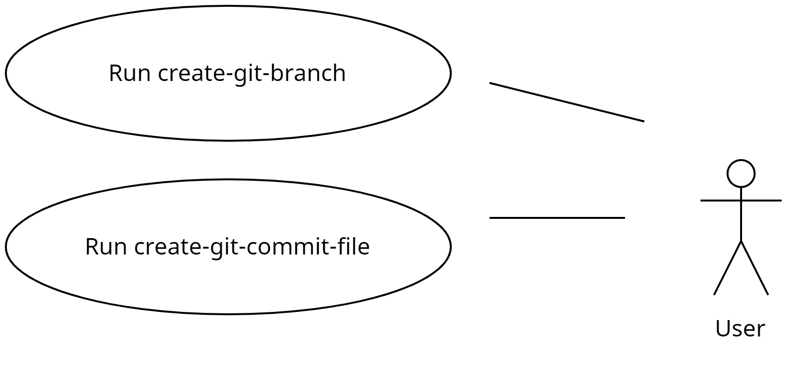

# git-helper-utils
Collection of Python utility scripts to facilitate git related tasks.

- [git-helper-utils](#git-helper-utils)
  - [Motivation](#motivation)
  - [Improvements](#improvements)
  - [Use Cases](#use-cases)
  - [Installation](#installation)
  - [Exported scripts](#exported-scripts)
    - [create-git-branch](#create-git-branch)
  - [Contributing](#contributing)
  - [To-Do/Coming Next](#to-docoming-next)
  - [CHANGELOG](#changelog)
  - [License](#license)


## Motivation

Explain what the motivation was for developing this package OR<br>
explain how this package was improved after being forked.


## Improvements

Please see the [TODO](TODO.md) for a list of upcoming improvements.


## Use Cases



## Installation

Please see the [INSTALL](INSTALL.md) guide for instructions.

## Exported scripts

The following exported scripts are available:

- create-git-branch
- create-git-commit-file


### create-git-branch

Sample invocation:

```shell
create-git-branch 
Please enter a description for the branch: add gene masking support
Please enter the type of branch to establish (valid options: ['feature', 'bugfix', 'hotfix', 'custom']): feature
Please provide the source branch (default is 'development'): main
Please enter the Jira ticket identifier or press ENTER to skip: BIO-2323
--outdir was not specified and therefore was set to '/tmp/git-helper-utils/create_git_branch/2023-12-30-224322'
Created output directory '/tmp/git-helper-utils/create_git_branch/2023-12-30-224322'
--logfile was not specified and therefore was set to 
'/tmp/git-helper-utils/create_git_branch/2023-12-30-224322/create_git_branch.log'
New branch: feature/BIO-2323-from-main-on-2023-12-30-224335-for-add-gene-masking-support
Switched to a new branch 'feature/BIO-2323-from-main-on-2023-12-30-224335-for-add-gene-masking-support'
The log file is '/tmp/git-helper-utils/create_git_branch/2023-12-30-224322/create_git_branch.log'
Execution of '/home/sundaram/projects/git-helper-utils/venv/lib/python3.10/site-packages/git_utils/create_git_branch.py' 
completed


git branch -a
* feature/BIO-2323-from-main-on-2023-12-30-224335-for-add-gene-masking-support
  main
  remotes/origin/HEAD -> origin/main
  remotes/origin/main
```


## Contributing

Pull requests are welcome. For major changes, please open an issue first
to discuss what you would like to change.

## To-Do/Coming Next

Please view the listing of planned improvements [here](TODO.md).

## CHANGELOG

Please view the CHANGELOG [here](CHANGELOG.md).

## License

[GNU AFFERO GENERAL PUBLIC LICENSE](LICENSE)
